# Phabricator使用

## 审查代码（Audit & Review code）

* Author把写好的代码上传到GitHub，然后git自动同步到Phabricator;

* 审核者登录Phabricator, 看到Audit图标右侧有两个数字，左边在蓝色圆框的表示有问题的commit，
右边那个数字则表示待审核的commit;

* 点击Audit进去，左边灰色栏为筛选器，看见有Problem Commits和Required Audits 这两个标题。Problem Commits 标题下的commit表示有问题的Commit，未审查前就已经Raised Concern。Required Audits标题下表示待审核的commit;

* 点击Problem Commits下或Required Audits下的 commit，审核者就可以看到跟新前跟跟新后代码的变化。
Commit下分为四个模块：

    * 第一个模块为列出代码上交的详细信息：

	| Left        |  含义                    | right                 |  含义                    |
	|-------------|--------------------------|-----------------------|--------------------------|
	| Status 	  |	 代码的状态				 | Edit Commit           |  编辑提交项目            |
	| Auditors    |  代码的审核者            | Edit Maniphtest Tasks |  管理自己所属的任务      |  
	| Committed   |  代码上传的时间          | Download Raw Diff     |  下载源代码              |  
	| Author      |  代码作者                | Remove Red Flag       |  提醒自己的标签          |
	| Parents     |  简述代码的功能          | Aword Token           |  表情标签（可增加可撤销）| 
	| Branches	  |  代码所属那个项目的分支	 |					     |  						|
	| Tags        |  代码的标签              |                       |  						|
	| Projects    |  代码所属的项目          |                       |                          |
	                  
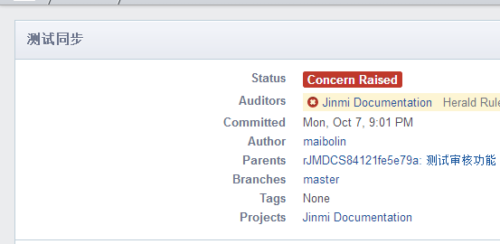

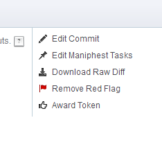
   
   * 点击Edit Commit,将会出现这个画面。

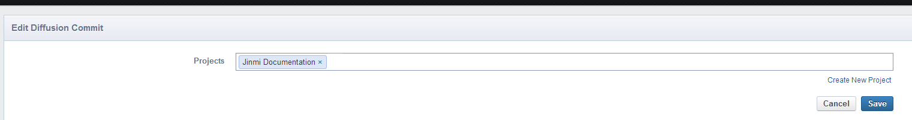 

   * 其主要作用是提交的代码块是所属哪个项目或修改其所属项目。

   * 点击Edit Maniphtest Tasks，将会出现这个画面。

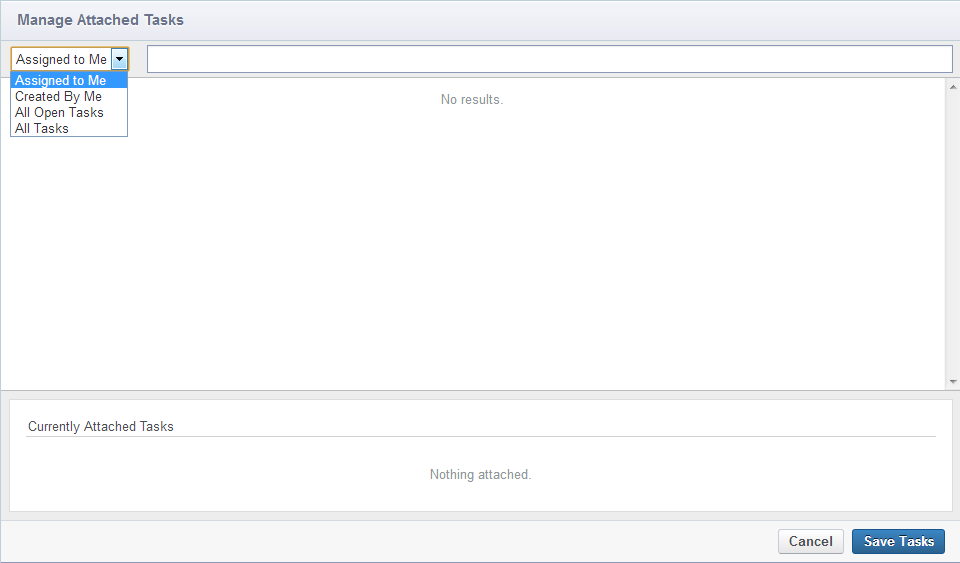

   * 其主要作用是管理任务。
   * 其中Assighed to Me属性表示列出我的任务，Created By Me的属性为列出我创建的任务，All Open Tasks属性为列出我
   未完成的所有任务，All Tasks属性为列出所有的任务。

   * 第二个模块包含两个部分，第一部分为User对代码块的评论，第二部分为列出代码块具体被修改的信息和他的历史信息。

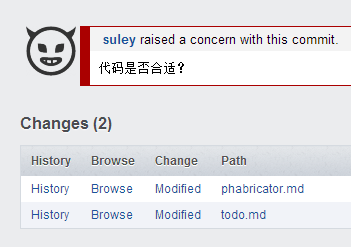

   * 第三个模块为展示被修改文件里代码跟新前跟跟新后代码块的变化。

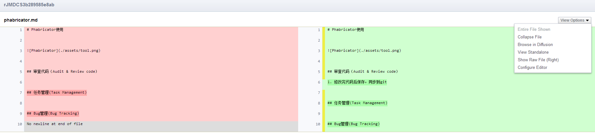

   * 其中左边表示未跟新前的原代码，右边为跟新后的代码。
   * 右侧有个拉列表 View Options 其主要作用是，审查者根据自己的需求来展示代码。

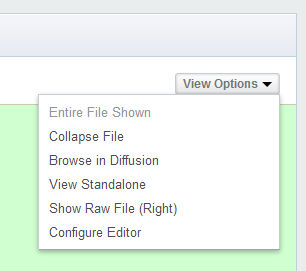
   
   * 在最下边有个Creative Accounting, 审核者在审查代码完之后可在这发表自己的观点。

## 任务管理(Task Management)
* 用户登录Phabrcator 点击Maniphest进去。
 
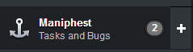

* 用户将看到一个灰色框和一个白色框，用户可以根据自己的需求而在灰色框选择或搜索。

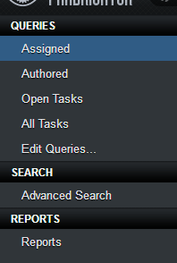

* 白色框表示你当前的任务。

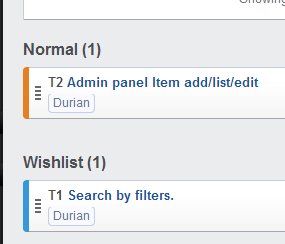

*选择其中一个任务进去。
*在右侧会出现

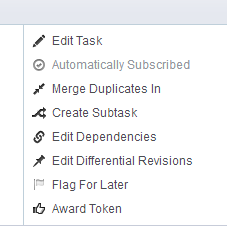

* Edit Task属性表示编辑任务，Merge Duplicates IN属性表示把一个或两个任务合并在一起。Create
Subtask属性表示新建一个子任务，子任务的情况可在Priority属性设置轻重缓急，Edit Dependencies的属性为继承关系，Edit Differential Revisions属性修正任务BUG的标签， Flag For Later属性为一个提醒标签，Award Token属性为表情评价。

* 最下边有一个Weigh in

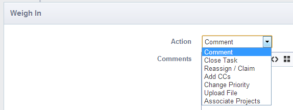

* Ation属性里边描述的是任务的状态。
* 你可以在Comment里边发表自己的评论。 
## Bug管理(Bug Tracking)
* Bug管理其实就是一个任务，当代码中出现BUG时，管理者可把BUG上传到Audit,让所有的user来讨论，然后指点最适合的那个User去完成这个任务。

