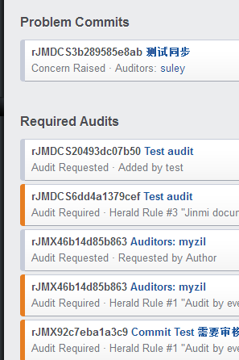
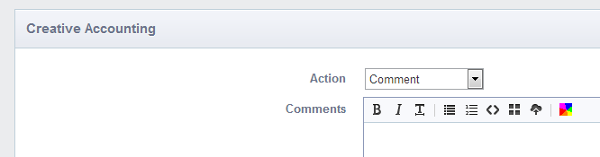

# Phabricator使用

## 审查代码（Audit & Review code）
1. 把写好的代码上传到GitHub，然后git同步到Phabricator;
2. 用户登录Phabricator, 看到Audit图标右侧有两个数字，左边在蓝色圆框的表示最新的，未审核的commit，
右边那个数字则表示已经审核的commit;

3. 点击Audit进去，看见有Problem Commits和Required Audits 这两个标题。Problem Commits 标题下的文件表示未审核的，等待用户审核的Commit。Required Audits标题下表示已经审核的commit.
4. 点击Problem Commits下的 commit，用户就可以看到跟新前跟跟新后代码的变化。在最下边有个Creative Accounting, 用户在审查代码完之后可在这发表自己的观点。 如：Accept Comment表示同意，Add Auditors表示上交给谁审查，Raise Concern表示改变代码后引发的担忧！

## 任务管理(Task Management)

## Bug管理(Bug Tracking)
